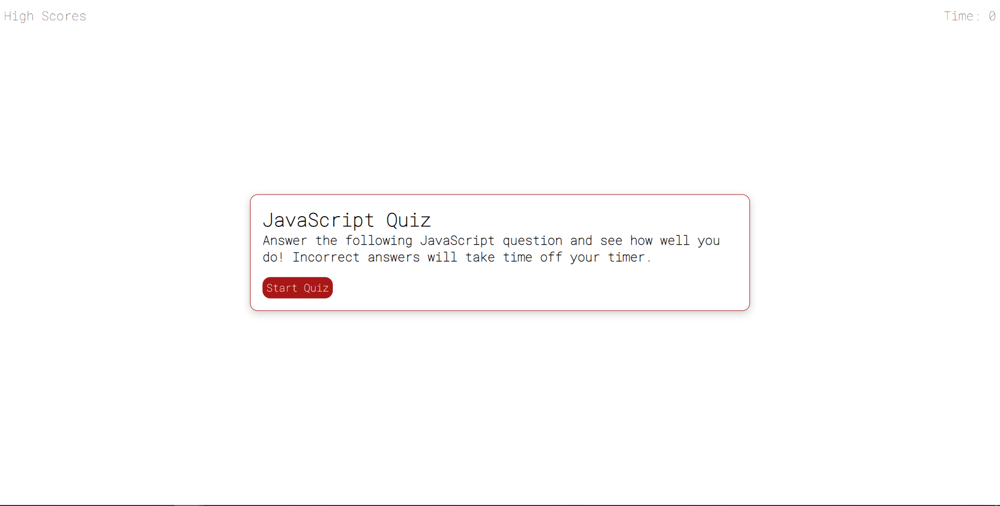

# JavaScript-Quiz
This project was completed for KU's coding boot camp assignment 4. 

The goal of this assignment was to make a quiz about JavaScript using JavaScript, HTML, and CSS.

## Check out the Project
Check out the different aspects of the project below:

- [GitHub Page](https://johnathanmann.github.io/JavaScript-Quiz/)
- [Repository](https://github.com/johnathanmann/JavaScript-Quiz)
- [Video of deployed application](https://drive.google.com/file/d/1Y2FbXSO5askib7_GrhGjoeJJwT_-9jkS/view)

## Install
Feel free to install using GitHubs recommended clone methods or by downloading the code and opening it in your preferred text editor.

## Requirements
To use the project all you need is a browser, but to access the code you need your text editor of choice.

## Summary
This site can be used to test you knowledge of basic JavaScript concepts. This is done by calling and hiding HTML mark up with JavaScript. The JavaScript dynamically updates the page based on user input while being responsive. 

### How does the quiz work?
After the start quiz button is hit the user is givin 60 seconds to complete the 5 question quiz. For each correct answer the user is given 10 points. For each incorrect question 10 seconds are taken off the timer. Then the user is asked to enter their initials. Their initials an their score is saved to local storage and then appended onto the score board.